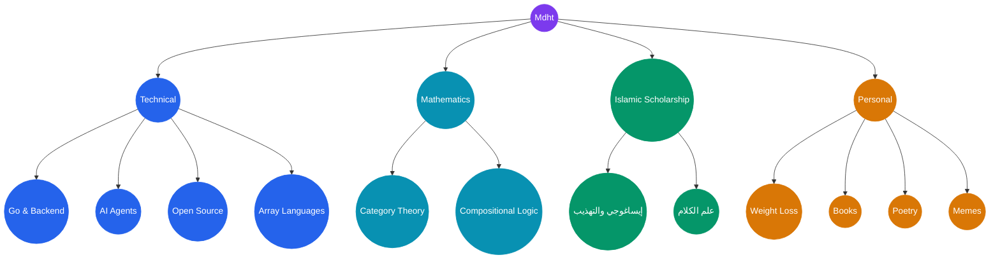

<MdhtHero />

```mermaid
graph TD
  me((Mdht))
  tech((Technical))
  math((Mathematics))
  islam((Islamic Scholarship))
  personal((Personal))

  me --> tech
  me --> math
  me --> islam
  me --> personal

  tech --> go((Go & Backend))
  tech --> ai((AI Agents))
  tech --> oss((Open Source))
  tech --> arr((Array Languages))
  math --> cat((Category Theory))
  math --> logic((Compositional Logic))
  islam --> iso((إيساغوجي والتهذيب))
  islam --> kalam((علم الكلام))
  personal --> wl((Weight Loss))
  personal --> books((Books))
  personal --> poetry((Poetry))
  personal --> memes((Memes))

  classDef root  fill:#7c3aed,stroke:#7c3aed,color:#fff
  classDef tech  fill:#2563eb,stroke:#2563eb,color:#fff
  classDef math  fill:#0891b2,stroke:#0891b2,color:#fff
  classDef islam fill:#059669,stroke:#059669,color:#fff
  classDef pers  fill:#d97706,stroke:#d97706,color:#fff

  class me root
  class tech,go,ai,oss,arr tech
  class math,cat,logic math
  class islam,iso,kalam islam
  class personal,wl,books,poetry,memes pers
```

Expect posts that wander across all of these. If something you read here doesn't fit your mental model of what a "tech blog" should be — good. That's the point.
