In 2026, this depends on the API mode you choose. In stateless message APIs, the model has no memory between calls unless your app re-sends prior turns. In stateful APIs, the provider can retain conversation state server-side so you can continue from a stored response/thread.

What you think of as a "conversation" is either: (a) your app serialising prior exchange into a messages list and re-uploading it each request, or (b) your app sending only the new turn while the provider resumes from previously stored state. Both patterns are used in production; they trade control for convenience differently.

The messages array is still the foundation for understanding context, costs, and failure modes — even when a provider offers stateful continuation on top.

---

## The messages array

Every LLM API call that involves conversation takes a `messages` parameter — an ordered array of objects. Each object has a `role` and a `content`. The model reads the array top-to-bottom, infers the conversation so far, and continues it.

```go
resp, err := client.Messages.New(ctx, anthropic.MessageNewParams{
    Model:     anthropic.F(anthropic.ModelClaudeOpus4_6),
    MaxTokens: anthropic.F[int64](1024),
    System: anthropic.F([]anthropic.TextBlockParam{{
        Type: anthropic.F(anthropic.TextBlockParamTypeText),
        Text: anthropic.F("You are a helpful assistant."),
    }}),
    Messages: anthropic.F([]anthropic.MessageParam{
        anthropic.NewUserMessage(anthropic.NewTextBlock("What is a context window?")),
        anthropic.NewAssistantMessage(anthropic.NewTextBlock("A context window is the maximum amount of text...")),
        anthropic.NewUserMessage(anthropic.NewTextBlock("How does it affect cost?")),
        // ↑ the model sees ALL of this, not just the last message
    }),
})
```

There are four roles. Each means something different to the model — click through them:

<DynamicComponent id="message-roles" />

The `system` role is special: it's sent as a top-level parameter on most APIs (not inside `messages`), but it functions the same way — it's part of the input the model reasons over, and it costs tokens on every call.

---

## Watching the context window grow

The context window **grows with every turn**. Not by the size of the new message — by the cumulative size of every message ever sent in the session.

<DynamicComponent id="agent-memory-v2" />

Notice what's happening in the right panel. Every time you send a message, the full array gets longer. Turn 3 doesn't just contain turn 3 — it contains turns 1, 2, and 3. By turn 10 you're sending 10× more data than you were at turn 1. The model doesn't cache your history; your app reconstructs and re-sends it every time.

This is why long chat sessions get expensive fast, and why "just keep chatting" is not a scalable architecture.

---

## The request cycle

What actually happens between you hitting Enter and seeing a response:

```mermaid
sequenceDiagram
    participant U as User
    participant App as Your App
    participant DB as Message Store
    participant API as LLM API

    rect rgb(14, 27, 46)
        note over U,App: User turn
        U->>App: types message
    end
    rect rgb(14, 46, 26)
        note over App,DB: History load + append
        App->>DB: load conversation history
        DB-->>App: messages[]
        App->>App: append new user message
    end
    rect rgb(30, 14, 46)
        note over App,API: Full array sent every call ✈
        App->>API: POST /messages (full array)
        API-->>App: assistant response
    end
    rect rgb(46, 26, 14)
        note over App,DB: Store + display
        App->>DB: save assistant message
        App-->>U: display reply
    end
```



In stateless flows, the expensive step is `POST /messages (full array, every turn)`. Your app is responsible for maintaining, loading, and re-uploading conversation history. In stateful flows, the server can hold that history and let you continue by referencing stored state (for example, continuing from a prior response id), which removes the need to resend the full array each turn.

Stateless control is a feature. It means you decide exactly what the model sees: redact turns, inject context mid-conversation, summarise older segments, or swap in retrieved documents. Stateful continuation is also useful, but it shifts some control and observability to the provider-managed layer.

---

## Token costs are cumulative

Every object in the messages array costs tokens — and tokens cost money and latency. This is the part that bites teams hardest in production.

<DynamicComponent id="context-demo-v1" />

The numbers are approximate. The shape is what matters: **token usage grows with every turn**. A 20-turn conversation isn't 20× the cost of 1 turn — it's closer to (1 + 2 + 3 + ... + 20) = 210× the cost of the first message. O(n²) if you're not careful.

The practical limits:

| Model | Context limit | Rough cost signal |
|---|---|---|
| Claude Haiku 4.5 | 200k tokens | Cheapest per token, fast |
| Claude Sonnet 4.6 | 1M tokens | Balanced; long-context premium above 200k input tokens |
| Claude Opus 4.6 | 1M tokens | Most capable; long-context premium above 200k input tokens |
| GPT-5.4 | 1.05M tokens (~1.1M) | Long-context penalty above 272k input tokens; max output is lower |

1M tokens sounds generous until long-context pricing kicks in. The exact trigger is provider/model specific and materially higher than 32k for the major 2026 models above (200k for Claude Sonnet/Opus 4.6 and 272k for GPT-5.4 input pricing penalties). The extended window is there when you need it; it is not uniformly priced. A typical English word is about 1.3 tokens, so 200k tokens is already a long novel. Budget pressure still arrives before the hard limit.

---

## Strategies for when the window fills up

No single right answer. But you need one.

<Split
  left={
    <>
      <h3>Sliding window</h3>
      <p style={{color: "var(--muted)", fontSize: "0.88rem", marginBottom: "12px"}}>Keep the last N messages. Simple, predictable. Loses early context — fine for conversational assistants, bad for agents that need to remember instructions from turn 1.</p>
      <CodeSnippet lang="go" code={`func slidingWindow(messages []Message, maxTokens int) []Message {
    var total int
    var result []Message

    // Walk backwards, keep newest first
    for i := len(messages) - 1; i >= 0; i-- {
        tokens := estimateTokens(messages[i])
        if total+tokens > maxTokens {
            break
        }
        result = append([]Message{messages[i]}, result...)
        total += tokens
    }

    return result
}`} />
    </>
  }
  right={
    <>
      <h3>Summarise + inject</h3>
      <p style={{color: "var(--muted)", fontSize: "0.88rem", marginBottom: "12px"}}>When the window gets full, ask the model to summarise old turns. Replace them with the summary. Preserves semantic content at a fraction of the tokens. Adds latency and an extra API call.</p>
      <CodeSnippet lang="go" code={`func summariseOldTurns(ctx context.Context, messages []Message, keepRecent int) ([]Message, error) {
    old    := messages[:len(messages)-keepRecent]
    recent := messages[len(messages)-keepRecent:]

    var sb strings.Builder
    sb.WriteString("Summarise this conversation concisely:\\n")
    for _, m := range old {
        fmt.Fprintf(&sb, "%s: %s\\n", m.Role, m.Content)
    }

    resp, err := client.Messages.New(ctx, anthropic.MessageNewParams{
        Model:     anthropic.F(anthropic.ModelClaudeHaiku4_520251001),
        MaxTokens: anthropic.F[int64](512),
        Messages: anthropic.F([]anthropic.MessageParam{
            anthropic.NewUserMessage(anthropic.NewTextBlock(sb.String())),
        }),
    })
    if err != nil {
        return nil, err
    }

    summary := resp.Content[0].Text
    return append([]Message{
        {Role: "user",      Content: "[Earlier summary]: " + summary},
        {Role: "assistant", Content: "Understood."},
    }, recent...), nil
}`} />
    </>
  }
/>

A third option — **RAG (retrieval-augmented generation)** — avoids storing conversation history altogether. Instead of replaying the conversation, you embed each turn and retrieve the semantically relevant ones at query time. This is what production chatbots with millions of users do. It's more infrastructure, but it's the only approach that scales to arbitrarily long sessions.

**Prompt caching** works when the expensive part of your context is stable across requests — a large system prompt, a reference document, a codebase. Most APIs let you mark a prefix as cacheable. Anthropic charges ~10% of the original write cost on cache hits. You're still paying for cached tokens, just much less. Effective only when that prefix doesn't change; a single token mutation invalidates the cache.

**Context compaction and stateful APIs** are another path. Provider-managed state can eliminate the reconstruct-and-re-upload loop by letting you continue from stored history. OpenAI's Responses flow can do this when state is stored and you continue from a prior response/thread reference; Anthropic also supports server-side context management features. The tradeoff is control and transparency: depending on product mode, you may have less ability to inspect, surgically redact, or deterministically reconstruct the exact prompt seen by the model. For many chatbots that’s acceptable; for agent systems with strict auditability, teams often keep explicit context assembly.

---

## Tool calls: the hidden cost

If you're using tool use / function calling, there's a wrinkle: tool calls and results are also messages. Every time the model decides to call a tool, your app needs to:

1. Append the model's tool-call request as an `assistant` message
2. Run the tool
3. Append the result as a `tool` message
4. Call the API again with the extended array

A single agentic "step" that involves 3 tool calls adds 6 messages to the context before the model sends a final reply. In a 10-step agent loop with 3 tool calls per step, you're sending 60+ messages on the final call — many of which are just scaffolding the model generated to reason through intermediate steps.

```go
// What one tool-call cycle looks like in the messages slice
messages := []anthropic.MessageParam{
    anthropic.NewUserMessage(anthropic.NewTextBlock("Search for recent papers on RAG")),
    {
        Role: anthropic.F(anthropic.MessageParamRoleAssistant),
        Content: anthropic.F([]anthropic.ContentBlockParamUnion{
            anthropic.ToolUseBlockParam{
                Type:  anthropic.F(anthropic.ToolUseBlockParamTypeToolUse),
                ID:    anthropic.F("toolu_01"),
                Name:  anthropic.F("web_search"),
                Input: anthropic.F[any](map[string]any{"query": "RAG papers 2025"}),
            },
        }),
    },
    {
        Role: anthropic.F(anthropic.MessageParamRoleTool),
        Content: anthropic.F([]anthropic.ContentBlockParamUnion{
            anthropic.ToolResultBlockParam{
                Type:      anthropic.F(anthropic.ToolResultBlockParamTypeToolResult),
                ToolUseID: anthropic.F("toolu_01"),
                Content:   anthropic.F(`[{"title": "RankRAG...", "year": 2025}]`),
            },
        }),
    },
    anthropic.NewAssistantMessage(anthropic.NewTextBlock("Here are three recent papers on RAG...")),
    // ↑ 4 messages for what looks like 1 exchange
}
```

If your agent is slow or expensive and you can't figure out why, count your messages. The answer is usually there.

One aside: MCP (Model Context Protocol) is standardising the format of tool-call messages across providers. If you're building multi-provider agents, the wire format is converging even if the SDK APIs haven't caught up yet.

---

## What this means in practice

A few rules that fall out of all this:

**Keep system prompts surgical.** Every token in the system prompt is paid on every call. A 1,200-token system prompt that hedges is 3× the cost of a 400-token one that's precise. Write it like you're paying per word — because you are.

**Log the full array, not just the last message.** When something goes wrong in an agent loop, you need to see exactly what the model was given. The surprising input is almost always buried in an earlier turn.

**Budget by turns, not by session.** Set a hard limit on how many turns a session can have before you force a summarisation or reset. Don't let users discover your context limit by accident.

**The model doesn't know what it doesn't see.** If you prune a message, the model reasons as if it never happened. This is a superpower (you can clean up bad turns) and a footgun (you can accidentally hide information the model needed).

---

The context window is still the most concrete, measurable resource in an LLM application. Everything else — prompt quality, temperature, model choice — is softer. This one is arithmetic. Know what you're sending (or delegating to provider-managed state), track how it grows, and have a plan for when it doesn't fit anymore.
