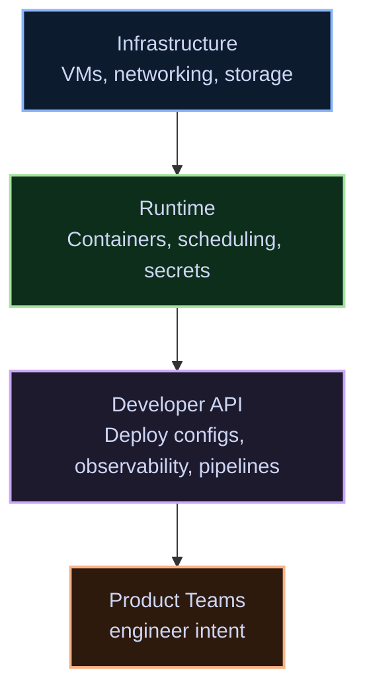

The goal of a platform team is to disappear. Not literally — but operationally. If engineers are thinking about the platform while writing product code, something is wrong.

> A platform is a product with internal users. Treat friction as a bug.

## The three-layer model

Every platform I've seen that works cleanly uses roughly the same decomposition:



The critical insight: only the **Developer API** layer is user-facing. Infrastructure and runtime are implementation details that can change without product teams noticing.

## What each layer owns

<Split
  left={
    <>
      <h3>What the platform exposes</h3>
      <ul>
        <li>A deploy config format engineers actually write</li>
        <li>Structured logs, metrics, traces — wired automatically</li>
        <li>Secret injection without credential management</li>
        <li>Rollback as a first-class operation</li>
      </ul>
    </>
  }
  right={
    <>
      <h3>What the platform hides</h3>
      <ul>
        <li>Cluster placement and node selection</li>
        <li>Certificate rotation and TLS termination</li>
        <li>Log aggregation pipeline and retention policy</li>
        <li>Underlying cloud provider primitives</li>
      </ul>
    </>
  }
/>

## The deploy config

Here's what a minimal, expressive deploy config looks like when the Developer API is well-designed:

```yaml
service: payments-api
image: ghcr.io/acme/payments-api:v2.4.1
replicas: 3
port: 8080

env:
  - name: DB_URL
    secret: payments/db-url
  - name: STRIPE_KEY
    secret: payments/stripe-key

health:
  path: /healthz
  interval: 15s

resources:
  cpu: 250m
  memory: 512Mi
```

The engineer never touches a Pod spec, a Service manifest, or an Ingress rule. The platform translates intent into infrastructure.

## The runtime adapter

The Go code that interprets that config and materialises it looks something like this:

```go
package platform

import (
    "context"
    "fmt"

    corev1 "k8s.io/api/core/v1"
    appsv1 "k8s.io/api/apps/v1"
    metav1 "k8s.io/apimachinery/pkg/apis/meta/v1"
)

// ServiceSpec is the Developer API — what engineers write.
type ServiceSpec struct {
    Name      string            `yaml:"service"`
    Image     string            `yaml:"image"`
    Replicas  int32             `yaml:"replicas"`
    Port      int32             `yaml:"port"`
    Env       []EnvEntry        `yaml:"env"`
    Resources ResourceSpec      `yaml:"resources"`
}

// Materialise converts intent into a Kubernetes Deployment.
// Engineers never call this directly.
func Materialise(ctx context.Context, spec ServiceSpec) (*appsv1.Deployment, error) {
    envVars, err := resolveEnv(ctx, spec.Env)
    if err != nil {
        return nil, fmt.Errorf("resolving env: %w", err)
    }

    return &appsv1.Deployment{
        ObjectMeta: metav1.ObjectMeta{
            Name:   spec.Name,
            Labels: map[string]string{"app": spec.Name},
        },
        Spec: appsv1.DeploymentSpec{
            Replicas: &spec.Replicas,
            Template: corev1.PodTemplateSpec{
                Spec: corev1.PodSpec{
                    Containers: []corev1.Container{{
                        Name:  spec.Name,
                        Image: spec.Image,
                        Ports: []corev1.ContainerPort{{ContainerPort: spec.Port}},
                        Env:   envVars,
                    }},
                },
            },
        },
    }, nil
}
```

## The leaky abstraction trap

Platforms fail when they leak. Signs your abstraction layer is leaking:

| Symptom | Root cause |
|---|---|
| Engineers need to know which region they're in | Deploy config doesn't abstract placement |
| Secret rotation requires code changes | Secrets aren't injected at runtime |
| Debugging requires cluster access | Observability isn't wired at the platform layer |
| Rollback is a runbook, not a button | Deploy contract doesn't own the full lifecycle |

Each leak is a maintenance cost paid in engineering time, not platform team time. The abstractions exist to protect product velocity — every hole in them charges interest.

The test: an engineer who joined last week should be able to deploy a new service, observe it, and roll it back without reading any infrastructure documentation.
