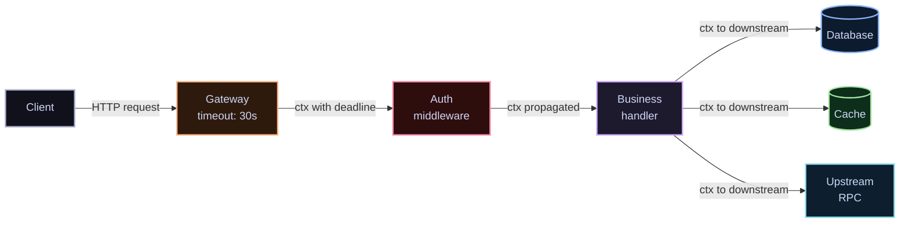

Go's `context.Context` is one of the most misunderstood primitives in the language. It's not just a way to cancel requests — it's the contract between every function in your call stack that says: *if the caller no longer needs the result, stop working*.

> Every blocking operation in a service should be context-aware. If it isn't, you've silently opted out of cancellation.

## What a request lifecycle looks like



The `context.Context` flows from the gateway — where the deadline is set — through every layer. Any function that calls a database, cache, or RPC must pass the context through. When the client disconnects, the cancellation propagates instantly.

## The middleware chain

Middleware is where the context is enriched. Each middleware adds a value or wraps the deadline, then hands the new context to the next handler.

```go
package middleware

import (
    "context"
    "net/http"
    "time"

    "github.com/google/uuid"
)

type contextKey string

const (
    RequestIDKey contextKey = "request_id"
    UserIDKey    contextKey = "user_id"
)

// RequestID attaches a unique ID to every request context.
func RequestID(next http.Handler) http.Handler {
    return http.HandlerFunc(func(w http.ResponseWriter, r *http.Request) {
        id := uuid.New().String()
        ctx := context.WithValue(r.Context(), RequestIDKey, id)
        w.Header().Set("X-Request-ID", id)
        next.ServeHTTP(w, r.WithContext(ctx))
    })
}

// Timeout enforces a hard deadline on the entire request.
func Timeout(d time.Duration) func(http.Handler) http.Handler {
    return func(next http.Handler) http.Handler {
        return http.HandlerFunc(func(w http.ResponseWriter, r *http.Request) {
            ctx, cancel := context.WithTimeout(r.Context(), d)
            defer cancel()
            next.ServeHTTP(w, r.WithContext(ctx))
        })
    }
}

// RequestIDFromCtx extracts the request ID, empty string if absent.
func RequestIDFromCtx(ctx context.Context) string {
    id, _ := ctx.Value(RequestIDKey).(string)
    return id
}
```

## Wiring a server

<Split
  left={
    <>
      <h3>Config</h3>
      <CodeSnippet lang="go" code={`type Config struct {
    Addr           string
    ReadTimeout    time.Duration
    WriteTimeout   time.Duration
    IdleTimeout    time.Duration
    // Per-request deadline
    // applied by Timeout middleware
    RequestTimeout time.Duration
}`} />
    </>
  }
  right={
    <>
      <h3>Server setup</h3>
      <CodeSnippet lang="go" code={`func New(cfg Config, h http.Handler) *http.Server {
    chain := middleware.Chain(
        middleware.RequestID,
        middleware.Timeout(
            cfg.RequestTimeout,
        ),
        middleware.Recover,
    )

    return &http.Server{
        Addr:         cfg.Addr,
        Handler:      chain(h),
        ReadTimeout:  cfg.ReadTimeout,
        WriteTimeout: cfg.WriteTimeout,
        IdleTimeout:  cfg.IdleTimeout,
    }
}`} />
    </>
  }
/>

## The handler

A handler that propagates context correctly looks like this:

```go
func (h *OrderHandler) Create(w http.ResponseWriter, r *http.Request) {
    ctx := r.Context()
    log := h.logger.With("request_id", middleware.RequestIDFromCtx(ctx))

    var req CreateOrderRequest
    if err := json.NewDecoder(r.Body).Decode(&req); err != nil {
        http.Error(w, "invalid request body", http.StatusBadRequest)
        return
    }

    // context is passed to every downstream call
    user, err := h.users.Get(ctx, req.UserID)
    if err != nil {
        if errors.Is(err, context.DeadlineExceeded) {
            log.Warn("user lookup timed out")
            http.Error(w, "request timeout", http.StatusGatewayTimeout)
            return
        }
        log.Error("user lookup failed", "error", err)
        http.Error(w, "internal error", http.StatusInternalServerError)
        return
    }

    order, err := h.orders.Create(ctx, user.ID, req.Items)
    if err != nil {
        if errors.Is(err, context.Canceled) {
            // client disconnected — no point sending a response
            log.Info("client disconnected during order creation")
            return
        }
        log.Error("order creation failed", "error", err)
        http.Error(w, "internal error", http.StatusInternalServerError)
        return
    }

    w.Header().Set("Content-Type", "application/json")
    w.WriteHeader(http.StatusCreated)
    json.NewEncoder(w).Encode(order)
}
```

Two things stand out: the handler explicitly checks for `context.DeadlineExceeded` and `context.Canceled`, and maps them to appropriate HTTP responses. Most handlers I've reviewed in the wild don't do this — they log an error and return 500 for what is actually a normal operational event.

## Middleware comparison

| Middleware | What it adds to context | Failure mode if absent |
|---|---|---|
| `RequestID` | Trace correlation ID | Logs unattributable across services |
| `Timeout` | Request deadline | Goroutine leak on slow upstream calls |
| `Recover` | Panic → 500 conversion | Process crash on unhandled panic |
| `Auth` | Verified user identity | Business logic must re-authenticate |
| `RateLimit` | Quota enforcement | Unbounded load on downstream dependencies |

The ordering matters: `Timeout` should wrap everything so the deadline is enforced across the entire chain, including auth.

Context isn't a magic solution to reliability — it's the mechanism that makes reliability *possible*. Every blocking call that ignores the context is a goroutine that doesn't know when to stop.
