A context window is not infinite tape. It's a fixed budget — every token you spend on something unhelpful is a token you can't spend on something that matters.

> The best context is the minimum context that produces the best output. Not more. Not less.

## How context flows in an agent loop

```mermaid
sequenceDiagram
    participant U as User
    participant A as Agent
    participant CM as Context Manager
    participant LLM as LLM API

    rect rgb(14, 27, 46)
        U->>A: user message
    end
    rect rgb(30, 14, 46)
        A->>CM: get context window
        CM->>CM: score + rank prior messages
        CM->>CM: trim to budget (e.g. 8k tokens)
        CM-->>A: trimmed context
    end
    rect rgb(14, 46, 26)
        A->>LLM: system + context + new message
        LLM-->>A: completion
    end
    rect rgb(46, 26, 14)
        A->>CM: store message + response
        A-->>U: response
    end
```



The context manager is the invisible layer most agent implementations skip. Without it, the context window fills with stale, low-signal history until the model starts hallucinating or you hit the token limit.

## The naive approach vs. the managed approach

<Split
  left={
    <>
      <h3>Naive: append forever</h3>
      <CodeSnippet lang="typescript" code={`// Just keep adding messages
const messages: Message[] = [];

async function chat(userMsg: string) {
  messages.push({
    role: "user",
    content: userMsg
  });

  const resp = await llm.complete({
    messages // grows unbounded
  });

  messages.push({
    role: "assistant",
    content: resp.content
  });

  return resp.content;
}`} />
      <p style={{color: "var(--muted)", fontSize: "0.88rem"}}>Hits token limit. Context quality degrades. No control over what the model sees.</p>
    </>
  }
  right={
    <>
      <h3>Managed: budget-aware window</h3>
      <CodeSnippet lang="typescript" code={`// Trim to budget before each call
async function chat(
  userMsg: string,
  history: Message[],
  budget = 8000
) {
  const window = trimTobudget(
    history,
    budget - countTokens(userMsg)
  );

  const resp = await llm.complete({
    messages: [...window, {
      role: "user",
      content: userMsg
    }]
  });

  return resp.content;
}`} />
      <p style={{color: "var(--muted)", fontSize: "0.88rem"}}>Predictable cost. Stable quality. Explicit control over context composition.</p>
    </>
  }
/>

## A token-aware context manager

Here's a TypeScript implementation of a context manager that scores messages by recency and relevance, then trims to a budget:

```typescript
import Anthropic from "@anthropic-ai/sdk";

type Message = Anthropic.MessageParam;

interface ScoredMessage {
  message: Message;
  tokens: number;
  score: number;
}

export class ContextManager {
  private history: ScoredMessage[] = [];
  private readonly budget: number;

  constructor(budget = 8000) {
    this.budget = budget;
  }

  add(message: Message): void {
    const tokens = this.estimateTokens(message.content as string);
    // Recency score: newer messages score higher
    const score = Date.now();
    this.history.push({ message, tokens, score });
  }

  window(): Message[] {
    // Sort by score descending, then take messages until budget is full
    const sorted = [...this.history].sort((a, b) => b.score - a.score);
    const selected: ScoredMessage[] = [];
    let used = 0;

    for (const item of sorted) {
      if (used + item.tokens > this.budget) break;
      selected.push(item);
      used += item.tokens;
    }

    // Restore chronological order for the model
    return selected
      .sort((a, b) => a.message.role.localeCompare(b.message.role))
      .map((s) => s.message);
  }

  private estimateTokens(text: string): number {
    // Rough approximation: 1 token ≈ 4 characters
    return Math.ceil(text.length / 4);
  }
}
```

For a production system you'd swap `estimateTokens` for a real tokenizer (Anthropic's token-counting endpoint, or `tiktoken` for OpenAI models). The estimation above is fine for ballparking.

## Strategies compared

| Strategy | Token usage | Freshness | Coherence | Best for |
|---|---|---|---|---|
| Append forever | Unbounded | High | Degrades over time | Short sessions only |
| Fixed sliding window | Predictable | High | Loses older context | Conversational agents |
| Score + trim | Predictable | Medium | Retains high-signal turns | Long-running agents |
| Summarise + append | Predictable | Low | Good | Archive-heavy workloads |
| Per-message RAG | Predictable | High | High | Large knowledge bases |

The right strategy depends on your task. For most conversational agents, a **score + trim** approach with a recency bias works well. For agents that need to reference early instructions or system state, a **summarise + append** cycle prevents context rot.

## What goes in the system prompt

The system prompt consumes budget before the first user turn. Keep it surgical:

```typescript
const SYSTEM = `You are a code review assistant.
Focus on: correctness, security, performance.
Format: use markdown. Be concise.
Never: suggest rewrites unless asked.`;
```

Every sentence in the system prompt is a standing cost on every call. Vague instructions that could be inferred from examples are waste. A 300-token system prompt that's precise beats a 1200-token system prompt that hedges.

The context window is the model's working memory. What you put there determines what it can reason about. Treat it like a scarce resource.
